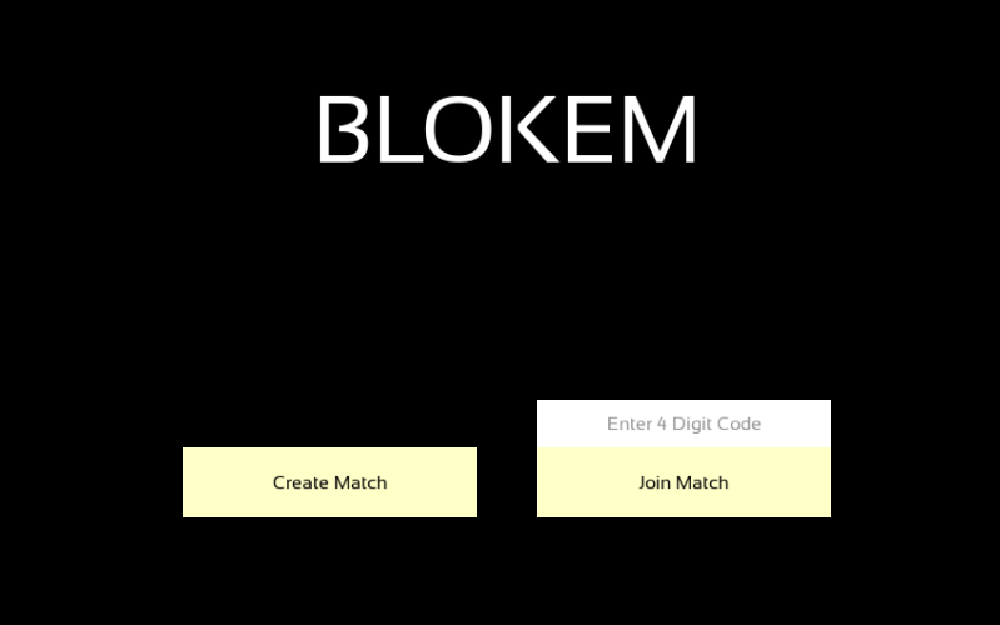

# Blokus (C++ / SFML / GoogleTest)
Blokus game, built in C++ using the [SFML](https://github.com/SFML/SFML) library, unit-tested with [GoogleTest](https://github.com/google/googletest). 

Continuous integration is configured via GitHub Actions.

## Title Page


## Prerequisites
* **Docker Desktop:** Download and install [Docker Desktop](https://www.docker.com/products/docker-desktop/). Ensure the Docker app is actively running.
* **CMake (v3.28+):** Required for configuring and building the client and tests.

## Run Blokus 

### Generate TLS Certificates (Stunnel Setup)
To generate new self-signed certificates for encrypted connections, run:

```
openssl req -x509 -nodes -days 365 -newkey rsa:2048 \
  -keyout certs/server.key \
  -out certs/server.crt \
  -subj "/CN=localhost" \
  -addext "subjectAltName=DNS:localhost"
```
### Start the Server
- Start the server container in the background (the `-d` flag keeps your terminal free for the next commands)
```
docker compose up --build -d
```

### Stop the Server
```
docker compose down
```

### Build
- Configure
```
cmake -B build
```
- Build
```
cmake --build build
```

### Start the Client
```
./build/bin/BlokusClient
```


### Unit Testing 
- Make sure you're in the project root directory
```
pwd
```

- Run Unit Tests

```
./build/bin/tests/BlokusClientTests
./build/bin/tests/BlokusSharedTests
./build/bin/tests/BlokusServerTests
```

### Debug Unit Test
- Run Unit test on lldb
```
lldb ./build/bin/tests/BlokusClientTests
```

Common LLBD commands:
- Set Breakpoint: `(lldb) b Player.cpp:45`
- Run: `(lldb) run`
- Next Line: `n`
- Step Into: `s`
- Print Variable: `p mHeldPiece`
- Continue: `c`
- Backtrace (on crash); `bt`


## Project Management
Tracked progress using Github's [Backlog](https://github.com/orgs/kyuhyunp-dev/projects/1)


